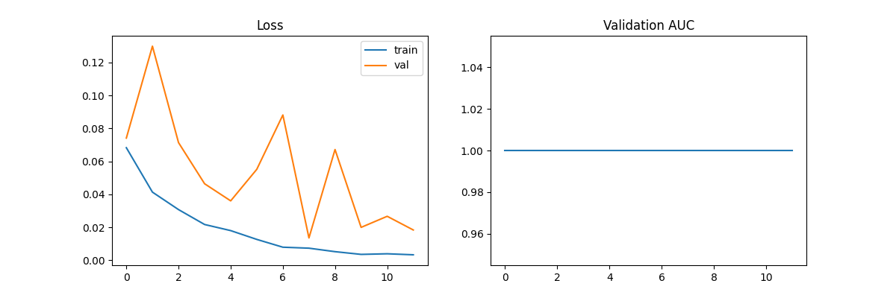
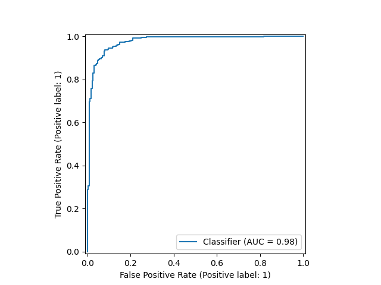
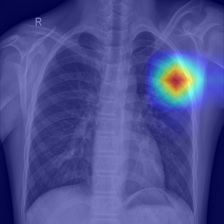
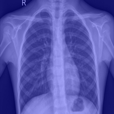
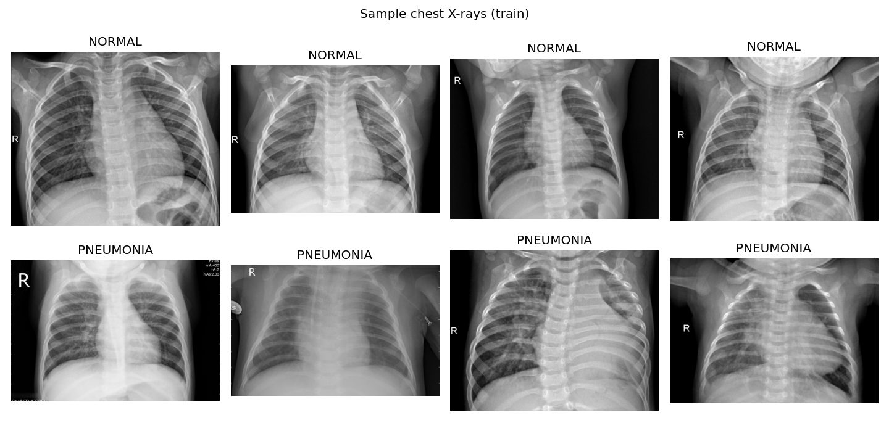
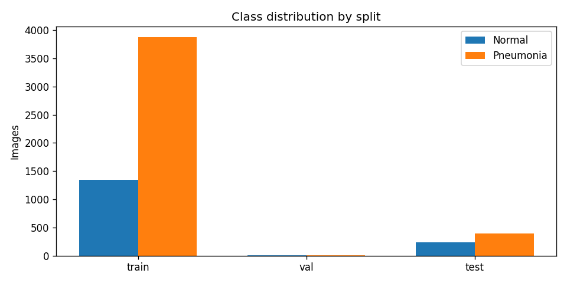

# Chest X-Ray Pneumonia Classifier

A deep-learning classifier that detects pneumonia from chest X-ray images, with Grad-CAM
heatmaps that show *which lung regions* drove each prediction. Built with PyTorch and
DenseNet-121, trained on 5,863 labeled X-rays.

## Results

| Metric | Score |
|---|---|
| Test AUC-ROC | **0.977** |
| Accuracy | **0.92** |
| Pneumonia precision / recall | 0.91 / **0.97** |
| Normal precision / recall | 0.95 / 0.84 |

Confusion matrix (rows = true, cols = predicted):

| | Pred Normal | Pred Pneumonia |
|---|---|---|
| True Normal | 197 | 37 |
| True Pneumonia | 10 | 380 |

The model catches 97% of pneumonia cases — the errors skew toward false alarms on
healthy lungs rather than missed infections, which is the safer failure mode for a
screening tool.




### What the model looks at

Grad-CAM heatmaps highlight the lung regions behind each prediction:




## The data

Chest X-ray images for pneumonia detection
([Kaggle](https://www.kaggle.com/datasets/paultimothymooney/chest-xray-pneumonia)) —
5,863 grayscale X-rays labeled NORMAL or PNEUMONIA.




The dataset is imbalanced (~3:1 pneumonia in training, and only 16 validation images),
so training uses a positive-class weight in the loss to keep the minority class from
being ignored, and model selection is done on validation AUC rather than accuracy.

## Approach

- **Model:** DenseNet-121 pretrained on ImageNet, with the final layer replaced by a
  single pneumonia logit. DenseNet's dense connections reuse features efficiently,
  which helps on small medical datasets.
- **Loss:** Binary cross-entropy with logits, weighted toward the minority class.
- **Optimization:** Adam (lr 1e-4) with cosine annealing, 12 epochs on a Tesla T4 GPU.
- **Augmentation:** Random resized crops, horizontal flips, and small rotations —
  standard for radiology images where orientation varies.
- **Interpretability:** Grad-CAM on the last convolutional block, so every prediction
  comes with a visual explanation a clinician can sanity-check.

## Try it

```bash
pip install -r requirements.txt
python src/train.py --data-dir data/chest_xray --epochs 12
python src/evaluate.py --checkpoint results/best_model.pth
python src/gradcam.py --num-images 8
streamlit run app/app.py
```

The training notebook (EDA, training, evaluation) is
[on Google Colab](https://colab.research.google.com/drive/1IbGNc9J48Gj_2JkfBc7mSMosSI5XDE8G).

## Project structure

```
src/
  dataset.py   # ChestXrayDataset, train/val transforms
  model.py     # DenseNet-121 with binary head
  train.py     # Training loop, class weighting, checkpointing
  evaluate.py  # Test metrics, ROC curve, confusion matrix
app/
  app.py       # Streamlit demo: upload an X-ray, get a prediction + heatmap
assets/        # Figures for this README
```

## Limitations & next steps

- Binary labels only (normal vs. pneumonia) — real triage needs multi-class
  (bacterial vs. viral) and severity grading.
- Single-dataset evaluation; cross-hospital generalization is untested.
- Next: test-time augmentation, model calibration, and comparison against a
  Vision Transformer baseline.

## Author

Sree Divya — UH Computer Science '27, Bioinformatics minor.
